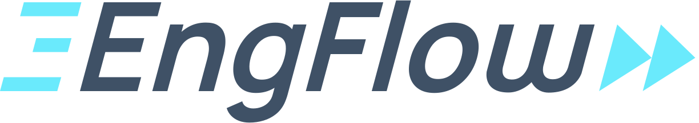

<div align="center">
  <a href="https://github.com/engflow/any2bazel">
    
  </a>
  <br>
  <br>

[![license][license]][license-url]
[![claude-code][claude-code]][claude-code-url]
[![bazel][bazel]][bazel-url]

  <h1>any2bazel</h1>
  <p>
    Generate and maintain <a href="https://bazel.build">Bazel</a> build files for a project so they remain in sync with another build system (<strong>CMake</strong>, <strong>Maven</strong>, and more) — whether as part of a migration, or to keep parallel builds consistent.
  </p>
</div>

## Table of contents

- [Get started](#get-started)
- [Introduction](#introduction)
- [Frontends](#frontends)
- [Case studies](#case-studies)
- [Contributing](#contributing)

## Get started

Install as a [Claude Code](https://claude.com/claude-code) skill:

```bash
npx skills add -g engflow/any2bazel
```

Then invoke it from your agent's CLI:

```
/any2bazel
```

> **Developed for [Claude Code](https://claude.com/claude-code) using Opus 4.8.**

## Introduction

any2bazel extracts what each build system *actually compiles and links* into a
canonical action model, then iterates until Bazel's build actions match. A
deterministic diff drives the loop — an LLM does only the creative work
(generating and fixing `BUILD.bazel` files).

- Diffs the actions each build performs.
- One **action-based IR** shared across frontends; the differ is language- and
  mnemonic-aware.
- **Asymmetric** flag comparison — textually different but semantically
  equivalent builds converge to zero errors.
- **Grouping-agnostic** for libraries and Java source sets — library renames
  and object-library fold-ins converge with no mapping.
- **Reviewer-auditable** suppressions in a checked-in `cmake2bazel.json`.
- **MVP scope** — no codegen, custom commands, or packaging yet.

> [!NOTE]
> This project is in its early stages, we welcome feedback and [contributions](#contributing)
> as we continue to evolve this tool.

### Source build support

| Frontend | Reference source | Status |
| :------- | :--------------- | :----- |
| **CMake** | File API codemodel-v2 | **Mature** — the validated path |
| **Maven** | forked `javac` argfiles | **Early** — argv-floor only |
| **VSCode / npm** | esbuild/tsc/`child_process` instrumentation | **Experimental** — standalone TS emit check |

## Case studies

| Project | Frontend | Notes |
| :------ | :------- | :---- |
| [Ladybird](docs/CASE-ladybird-migration.md) | CMake | Full case study — performance & flag canonicalization |
| [VSCode](docs/CASE-vscode-migration.md) | npm/esbuild | 7710/7710 `.js` byte parity |
| BoringSSL, Abseil, RE2, fmt, spdlog, TinyXML2, zlib | CMake | See [EXPERIMENTS.md](EXPERIMENTS.md) |
| Guava | Maven | See [EXPERIMENTS.md](EXPERIMENTS.md) |

## Contributing

Contributions are welcome. Please send any feedback and changes to the main
repo at https://github.com/EngFlow/any2bazel.

[license]: https://img.shields.io/badge/license-Apache%202.0-blue.svg
[license-url]: LICENSE
[claude-code]: https://img.shields.io/badge/Claude%20Code-skill-8a63d2.svg
[claude-code-url]: https://claude.com/claude-code
[bazel]: https://img.shields.io/badge/Bazel-migration-43a047.svg
[bazel-url]: https://bazel.build
