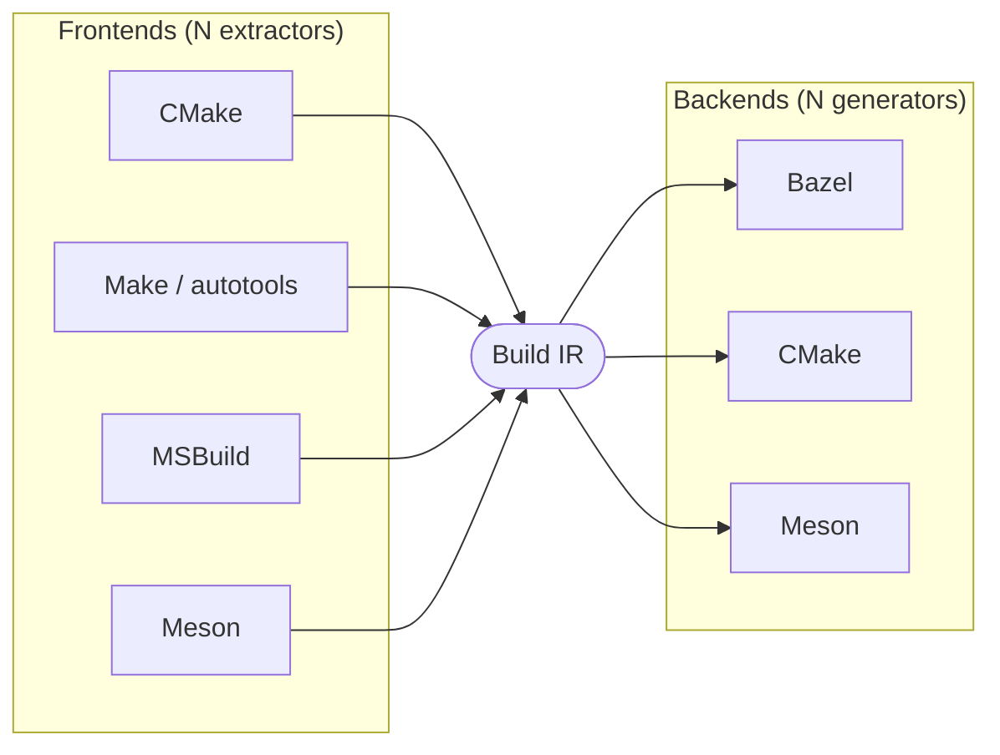
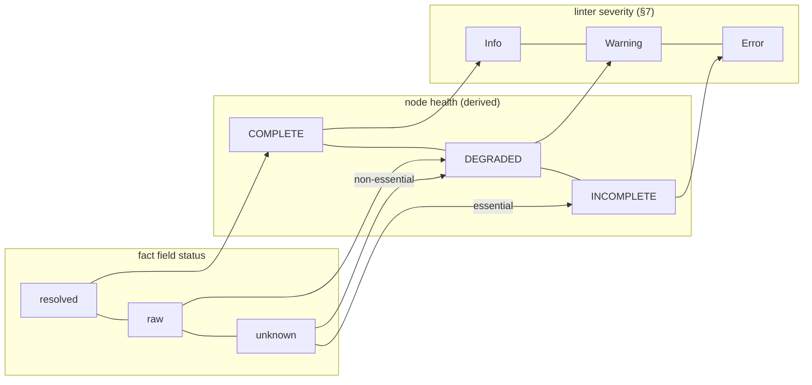
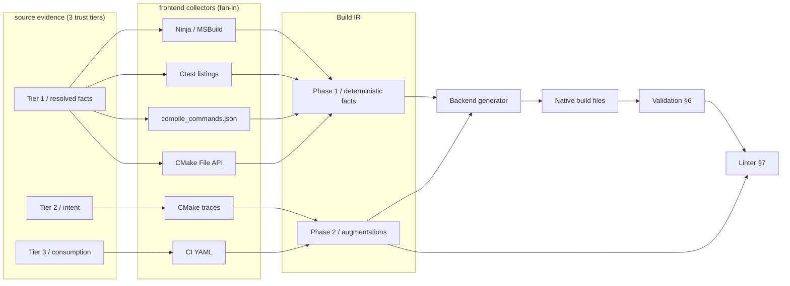
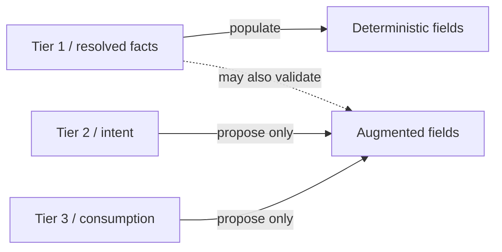
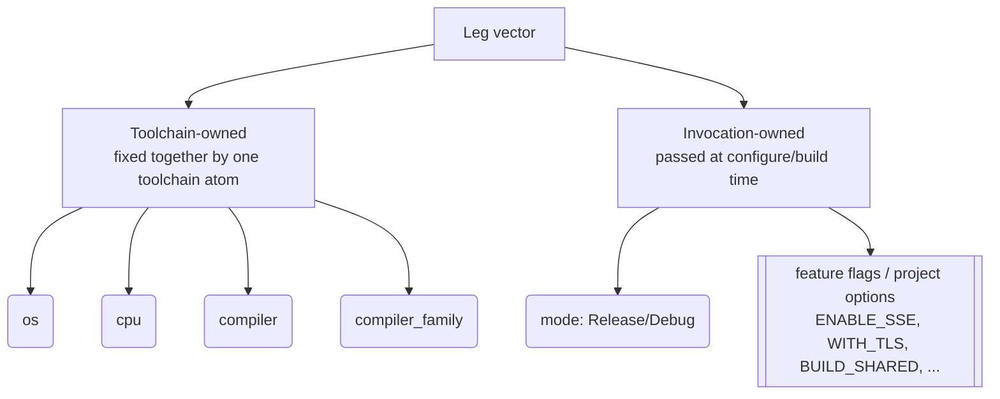
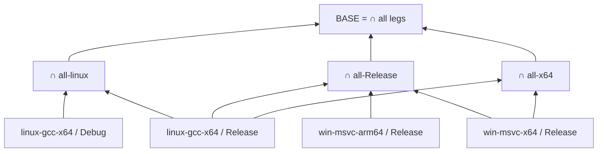
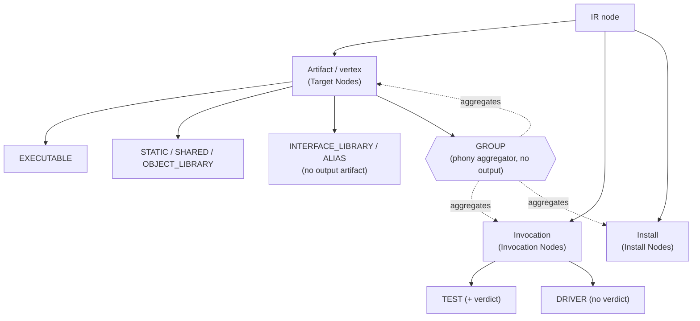
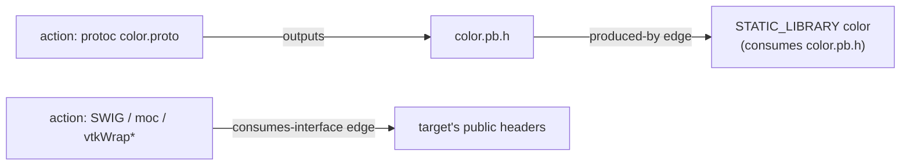

# Build System Intermediate Representation (Build IR)

## Table of Contents

1. [Abstract](#1-abstract)
2. [Glossary & Core Concepts](#2-glossary--core-concepts)
   - [Reference Example](#reference-example)
   - [Term Reference](#term-reference)
   - [Three Concepts Worth Reading First](#three-concepts-worth-reading-first)
3. [Core Goals & Principles](#3-core-goals--principles)
4. [The Build IR Data Model & Lifecycle](#4-the-build-ir-data-model--lifecycle)
   - [The Source Evidence Model](#the-source-evidence-model)
   - [Root Workspace](#root-workspace)
   - [The Overlay Model](#the-overlay-model)
   - [Node Categories](#node-categories)
   - [Target Nodes / Vertices](#target-nodes--vertices)
   - [Dependency Edges](#dependency-edges)
   - [Action Nodes & Edges / Custom Actions & Templates](#action-nodes--edges--custom-actions--templates)
   - [Toolchains / Execution Environment](#toolchains--execution-environment)
   - [Invocation Nodes (Tests & Drivers)](#invocation-nodes-tests--drivers)
   - [Install Nodes / Packaging Rules](#install-nodes--packaging-rules)
5. [Phase 2 Confidence Tiers](#5-phase-2-confidence-tiers)
6. [Validation](#6-validation)
7. [The Linter / Semantic Lint](#7-the-linter--semantic-lint)
8. [Polyglot Extension (Future Work)](#8-polyglot-extension-future-work)

---

## 1. Abstract

Migrating between native C/C++ build systems (e.g., make, autotools, CMake, MSBuild, Bazel, Meson) is largely manual and error-prone. Writing a direct translator for each source/target pair is O(N^2) in the number of build systems supported, and such translators tend to produce non-idiomatic output because build systems differ in how they handle configuration-time evaluation, dependency encapsulation, and source globbing.

The **Build IR (Intermediate Representation)** reduces this to an O(N) problem by inserting a shared intermediate representation between frontends and backends: each build system needs one extractor (to IR) and one generator (from IR), rather than a translator per pair. A frontend extracts build facts into the IR; a backend generates native build files from it. Extraction runs as multiple passes across target platforms so that platform-specific differences can be recorded as diffs against a common base graph. The IR stores two kinds of data: deterministic execution facts (compilation flags, explicit file linkages, generated files) and augmented data inferred by heuristics or an LLM (API boundaries, globbing, toolchains).



*N extractors + N generators (O(N)) replace a translator per source/target pair (O(N²)).*

---

## 2. Glossary & Core Concepts

### Reference Example

Wherever a concept benefits from a concrete case, this spec refers the following small project as  `➡️ Example` callout:

```
acme/                     A C++ project built across a small matrix.
├── proto/
│   └── color.proto       → protoc generates color.pb.{h,cc} (a HOST codegen action)
├── libcolor/             STATIC_LIBRARY "color"
│   ├── color.cpp         consumes the generated color.pb.h
│   ├── simd_x64.cpp      compiled only on x64 legs (-DENABLE_SSE)
│   └── geometry.cppm     C++ module: `export module geometry;`
├── app/                  EXECUTABLE "app"  (deps: color)
│   └── main.cpp          `import geometry;`
└── tests/
    └── color_test.cpp    TEST

Build matrix ("legs"):
  linux-gcc-x64   / Release   win-msvc-x64   / Release
  linux-gcc-x64   / Debug     win-msvc-arm64 / Release
```

### Term Reference

| Term | One-line definition | Detailed in |
|---|---|---|
| **Frontend / extractor** | Format-specific collector that reads a source build and emits IR. | §4 / Source Evidence Model |
| **Backend / generator** | Consumes only normalized IR and emits a native build system. Knows no source format. | §4 / Source Evidence Model |
| **IR** | The shared intermediate representation; the strict API boundary between frontend and backend. | §1, §4 |
| **Phase 1 (extract facts)** | Extract fully resolved, correct-by-construction facts. | §3, §4 |
| **Phase 2 (aggregate & augment)** | Recover developer intent via heuristics/LLM (globs, boundaries, normalized commands). | §3, §5 |
| **Trust tier (1/2/3)** | Trust class of a *source*: resolved facts (1), intent (2), consumption (3). Governs where its data may land. | §4 / Source Evidence Model |
| **Provenance** | Per-fact record of which source(s) produced it, at what tier, plus origin/status/reason. | §4 / Provenance |
| **`origin` (extracted / human)** | Whether a tool read a fact or a person stated it; human-stated facts enter at a declared tier and win within-tier conflicts. | §4 / Provenance |
| **resolved / raw / unknown** | A fact field's tri-state: interpreted / present-but-uninterpreted-bytes / absent-with-reason. | §4 / Failure Semantics |
| **`unknown` ≠ empty** | Absence and known-emptiness are distinct; never default `unknown`. | §4 / Failure Semantics |
| **Health (COMPLETE / DEGRADED / INCOMPLETE)** | Derived per-node rollup of field statuses driving the generator's per-target decision. | §4 / Failure Semantics |
| **Essential field** | A Tier-1 field a node cannot be generated without; defined per node category/type. An `unknown` one → INCOMPLETE. | §4 / Failure Semantics, Node Categories |
| **Recovered / Suggested** | Confidence tier of an augmentation: read from an intent source (auto-applied) vs heuristic guess (needs review). | §5 |
| **Faithful Transfer** | Fidelity to the source's *encoded* intent, not improvement beyond it (globs stay globs; lists stay lists). | §3 |
| **Leg** | One fully resolved build under one fixed configuration; dense, non-composable. | §4 / Overlay Model |
| **Leg vector** | The keyed constraint assignment identifying a leg (toolchain-owned + invocation-owned dimensions). | §4 / Overlay Model |
| **Constraint dimension** | A configured axis build logic may branch on (`os`, `cpu`, `mode`, a feature flag). | §4 / Overlay Model |
| **Intersection lattice** | Bottom-up lattice of leg-group intersections; computes every matrix projection, not one nesting. | §4 / Overlay Model |
| **Base graph** | The intersection of all legs - facts common to every leg. Each leg = base + overlays. | §4 / Overlay Model |
| **Overlay (attribute / presence)** | A per-node diff against the base: differing attributes, or present-in-only-some-legs. | §4 / Overlay Model |
| **Face / constraint cube** | A leg-set expressible as a conjunction of constraint equalities; generates one clean `select()`. | §4 / Overlay Model |
| **Node kinds** | The three IR node kinds (graph *vertices*): artifact (*Target Nodes*), invocation (*Invocation Nodes*), install (*Install Nodes*). | §4 / Node Categories |
| **Graph roles** | The §4 data model is a directed graph: *vertices* (*Target Nodes*, *Invocation Nodes*, *Install Nodes*), *edges* (*Dependency Edges*, plus the produced-by/consumes-interface edges in *Action Nodes & Edges*), and the off-graph *environment* (*Toolchains*). | §4 |
| **`exec_platform` (HOST / TARGET)** | Which toolchain an action/test runs under - the build machine vs the built-for platform. | §4 / Toolchains |
| **Produced-by edge** | Links an action's `outputs` to the targets consuming those files; basis of "is generated". | §4 / Action Nodes & Edges |
| **Consumes-interface edge** | An action that reads another target's public `headers` (wrappers: `moc`, `SWIG`, `vtkWrap*`). | §4 / Action Nodes & Edges |
| **BMI** | Binary Module Interface (`.pcm`/`.ifc`/`.gcm`); a compiler-specific build output, never an IR fact. | §4 / Target Nodes → C++ Modules |

### Three Concepts Worth Reading First

Three load-bearing concepts that the rest of the model depends on.

- **Two-phase split.** *Phase 1* extracts facts that are correct by construction
  (what the build actually did). *Phase 2* recovers intent the build erased (why it is
  shaped that way) via heuristics and LLM inference. The deterministic/augmented
  distinction in every section maps onto this split, and so does health: missing facts
  can block a migration, a missing augmentation never does - it only costs idiomaticity.

- **Three trust tiers gate where data lands.** Sources are classed by trust:
  Tier 1 resolved facts, Tier 2 intent, Tier 3 consumption. The inviolable rule -
  *lower tiers may only propose, never populate* - keeps Phase 1's correctness
  guarantee intact: a synthesized CI fact can only ever reach an *augmented* field.

- **Field → health → lint chain.** Every fact field is `resolved` / `raw` /
  `unknown`. Those statuses roll up (computed) into node health
  (`COMPLETE` / `DEGRADED` / `INCOMPLETE`), which translates straight into the linter's
  severity (Info / Warning / Error). This one chain is how permissive extraction stays
  safe - nothing is silently dropped; partial-ness is surfaced.



---

## 3. Core Goals & Principles

### What This Architecture Achieves

* **Decouple Extraction from Generation:** A frontend extractor should know nothing about Bazel; a backend generator should know nothing about CMake. The Build IR is the strict API boundary between them.
* **Cross-Platform Support:** The generated build system must not be platform-specific. The IR stores a base graph plus per-platform overlay layers (diffs keyed by a constraint such as OS or CPU), so the backend can emit native conditional logic (e.g., Bazel `select()`).
* **Two Phases (Deterministic vs. Augmented):** 
  * *Phase 1 (extract facts):* Extract fully resolved arrays, absolute paths, and explicit commands. These are taken directly from the build and are correct by construction.
  * *Phase 2 (aggregate & augment):* Recover developer intent by applying heuristics and LLM-assisted inference to deduce boundaries, reconstruct globs, and normalize shell commands. Augmentations carry a confidence tier (see *Phase 2 Confidence Tiers*): those *recovered* from intent sources are high-confidence; those *suggested* by heuristics alone need human review.

* **Idiomatic Output:** The generated build files should be close to what a build engineer would write by hand, rather than a verbatim dump of resolved facts.
* **Default to faithful Transfer, Not Improvement:** The tool targets fidelity to the source's *encoded* intent, not improvement beyond it. If the source globbed, the output globs; if the source listed files explicitly, the output lists them explicitly - future-file behavior is then identical to the original, which is the most that is logically available (a migration is at best as good as the source state at conversion time). The one sanctioned improvement is transformations **provably equivalent over the observed legs** - e.g., collapsing a flag repeated across four legs into one `select()`. Transformations that alter *unobserved or future* state (e.g. promoting an explicit file list to a glob) are speculative and must not be applied silently; they require human sign-off. A human may also deliberately override the encoded intent - the sanctioned channel is an explicit human assertion (`origin: human`, *Provenance*), audited and linter-surfaced, never an inference. There could be an opportunity for a `tidy` tool to offer structure- or augmentations-based improvements (offer to switch globs to short lists in certain cases).
* **Deterministic Generation Core:** Generation - IR to native build files - is a pure function of the IR: the same IR produces the same output, and the generator invokes no LLM or heuristic. All nondeterministic inference is confined upstream to Phase 2 augmentation, whose results are pinned in the IR before generation runs. This baseline output is the reproducible artifact that code review diffs and CI regenerates; review, the linter, and hand edits all operate on the stable IR, so regeneration after an edit changes only what the edit changed. The baseline is always **complete and correct on its own** - any LLM enhancement (below) layers on top, never required to reach a working build.

### Non-Goals

* **Full End-to-End Determinism:** Only the generation *core* is deterministic (above). The tool may offer an **optional, opt-in enhancement pass** - the **output-local** stage of *Augmentation Stages* (§5) - that feeds the baseline output through an LLM to expand comments, improve naming, and make the result read as an *engineered* solution rather than generated code, trading byte-for-byte reproducibility for idiomaticity. It is the sanctioned venue for improvement-beyond-faithful-transfer (the LLM-driven successor to the `tidy` tool gesture). Two invariants bound it: it is **never load-bearing for correctness** (a user needing reproducibility stops at the baseline), and its output stays subject to *Validation* Pass 2 - so its freedom is widest on graph-invariant changes (comments, formatting) and narrows to whatever the command-graph comparison can bless as equivalent. It operates on the generated text for now; structured IR access for the enhancer (e.g. via tool calls) is future work.

* **We are not building an Execution Engine:** The Build IR tooling does not compile C++ code or execute test binaries. It *does* invoke a build system's configuration/analysis phase to extract a resolved command graph - both from the source (for extraction) and from the generated output (for validation; see *Validation*).
* **Zero-Touch Migrations for Legacy Code:** We do not expect 100% perfect, "one-click" migrations without human review. The architecture embraces a permissive "fail-safe" extraction phase, followed by a linting phase that highlights semantic violations for human correction.

---

## 4. The Build IR Data Model & Lifecycle

The end-to-end pipeline: many format-specific collectors fan *in* to the IR, the IR
holds Phase 1 facts plus Phase 2 augmentations, the backend generates native build
files, and two safety passes (Validation and the Linter) check the result.



### The Source Evidence Model

The frontend is a **fan-in of many format-specific collectors**. It consumes as much evidence as a project exposes and normalizes it into the IR. Sources fall into three **trust tiers**, and a fact's storage is governed by the tier of the source that produced it.

* **Tier 1 - Resolved execution facts (highest trust).** What the build *actually did*: `compile_commands.json`, the Ninja/MSBuild action graph, the CMake File API reply, the `ctest` test listing. Correct by construction. These - and only these - populate the deterministic fields (Phase 1, `base_targets`, etc.).
* **Tier 2 - Intent sources (high trust, describes intent not outcome).** Why the build is shaped as it is, including things execution erased: `CMakeLists.txt` / `Makefile` text, `cmake --trace-expand` and `configure_file()` traces, the configure/build invocation command. Used to *recover* intent (globs, templating, the leg vector) during augmentation.
* **Tier 3 - Consumption sources (lowest trust, aspirational).** How the build is driven from outside: CI scripts (e.g. a CI `matrix:` block, which often *is* the leg matrix), READMEs, packaging/install manifests. Useful for discovering which legs ship and what the public surface is. An LLM may be able to synthesize them into structured hints.



*Only Tier 1 may populate deterministic fields. Tiers 2–3 may only propose into
augmented fields - the boundary that keeps "Phase 1 is correct by construction" intact.*

Three rules make consuming everything safe:

* **Lower tiers may only propose, never populate.** A Tier 2 or Tier 3 fact may only ever land in an *augmented* field. If a synthesized CI fact reached a deterministic field, the "Phase 1 is correct by construction" guarantee would be void.
* **The IR is the format-specificity boundary.** Collectors are plural and format-specific (Ninja parsing, MSBuild XML, CMake traces). They normalize into uniform IR evidence; **nothing downstream of the IR may know which collector a fact came from.** The exception is recorded provenance (below), kept for validation/debugging only.
* **Graceful degradation; Tier 1 is sufficient.** A project exposing only Tier 1 must still produce a *correct* (if more explicit, less idiomatic) migration. Tiers 2–3 are strictly additive - they raise idiomaticity and recover intent; they are never preconditions for correctness. The linter reports low-confidence-but-correct migrations when intent sources are absent.

#### Provenance

Every fact in the IR - deterministic or augmented - carries a `provenance` record: which source(s) produced it and at what trust tier.

```
provenance: {
  sources: [ "compile_commands.json", "CMakeLists.txt:42", ... ],
  tier: 1 | 2 | 3,
  origin: "extracted" | "human",             // tool-read vs human-stated (see below)
  status: "resolved" | "raw" | "unknown",    // see Failure Semantics
  reason: <string>,                          // required when status != resolved
  was_probed: <bool>,                        // value derived from a configure-time probe, not a literal (Toolchains)
}
```

Provenance enforces the tier rule (deterministic fields must be tier 1), powers **cross-source validation** (the same fact seen in two sources raises confidence; a conflict is a divergence signal caught at extraction time, resolved by the rule in *Validation* Pass 1), records extraction failure at field granularity, and gives the linter its confidence signal.

**`origin` - extracted vs human.** Independent of both `tier` (how trusted the source) and `status` (how interpreted the value): it records whether a *tool read* the fact or a *person stated* it.

* **Human intent enters at Tier 2** - "treat this as a glob", "this dep is private", "this action runs on `HOST`". It proposes into *augmented* fields only, exactly like extracted Tier-2 intent, and is `Recovered`-grade (the answer is stated, not guessed).
* **Human assertion enters at Tier 1** - the **one sanctioned exception** to "Tier 1 is correct by construction / lower tiers only propose". To overwrite (or fill) a deterministic field, the human must assert it *at Tier 1*, taking explicit responsibility for a hard fact; a mere Tier-2 hint can never silently rewrite a deterministic field. The displaced extracted value is retained in `provenance`, and the linter surfaces the divergence as **Info** (output intentionally departs from the source here - sanctioned deviation from *Faithful Transfer*, because a human asked). A human assertion is a human edit in the sense of the *Deterministic Generation Core* (§3): it lives in the IR and must survive re-extraction.

#### Failure Semantics

Extraction is permissive and fail-safe: a node is **never silently dropped or quietly defaulted** when extraction is incomplete. Partial-ness is recorded explicitly, at field granularity, via the `status` in `provenance`.

**Every fact field is tri-state:**

* **`resolved`** - present and interpreted. The normal case; trusted per its tier.
* **`raw`** - present but uninterpreted (e.g. a `copts` string the flag parser didn't recognize, a `raw_command` whose path didn't normalize). The literal bytes are retained and **passed through unchanged** to the generated build. This is *Faithful Transfer* applied to a parse failure: correctness is preserved, only idiomaticity is lost. `raw` and `unknown` are distinct states - `raw` has the bytes, `unknown` does not.
  * **`raw` is not exempt from hermeticity.** `raw` means the flag's *meaning* is uninterpreted - it does not exempt the bytes from the absolute-path scan. Spotting `/abs/path` inside a string is lexical; it never needs to know what the flag does. So every `raw` string is still scanned (*Hermetic Abstraction*, *Toolchains*), and:
    * A path that can be rewritten workspace-relative **is** rewritten. Rewriting is best-effort, because the flag's grammar is unknown - `-I/abs` and `-fplugin=/abs` join their paths differently, so the rewriter cannot always tell where the path begins.
    * A path that **cannot** be rewritten is a portability hole (the migrated build breaks on another machine), raised as a linter **Error** - the same treatment as an un-abstractable test path (*Invocation Nodes*), not a mere loss of idiomaticity.

    In short: `raw` lets the backend choose how to *emit* the bytes (pass through, drop, or best-effort handle), but the absolute-path scan is mandatory either way.
* **`unknown`** - absent, with a recorded `reason` (scanner didn't run, leg unavailable, etc.). 

**`unknown` ≠ empty.** Absence-of-data and known-to-be-empty must be distinguishable in the schema, and consumers must never default `unknown` to a value. `deps: []` (verified: links nothing) is a fact; `deps: unknown` (never determined) is not - defaulting it to `[]` causes silent under-linking.

**Node-level health rollup.** `health` is **not stored** - it is derived on demand from the node's fields' `provenance.status`, so it can never drift out of sync with the facts it summarizes. It aggregates those field states into the generator's per-target decision:

* **`COMPLETE`** - all fields `resolved`. Generate idiomatically.
* **`DEGRADED`** - not `COMPLETE`, but every *essential* field is present (`resolved` or `raw`). Covers `raw` fields (generate via passthrough) and `unknown` *non-essential* fields (generate without them). Idiomaticity reduced; correctness preserved.
* **`INCOMPLETE`** - an essential field is `unknown`. Cannot be safely generated; must be handed to a human.

These are total: every node is exactly one (`INCOMPLETE` if any essential field is `unknown`; else `COMPLETE` if all fields `resolved`; else `DEGRADED`).

A field is **essential** if it is a deterministic (Tier 1) field the node cannot be generated without. Essentiality is defined **per node category and type** - no field is essential across categories (see *Node Categories*):

* `sources` - essential for a compiled library, but *not* for an `INTERFACE_LIBRARY` (header-only, legitimately source-less) or an `ALIAS` (carries only a forward reference).
* `destination` - essential for an install rule.
* `command` - essential for a test.

Missing *augmentation* (a `suggested_glob`, a visibility guess) never affects health - it only costs idiomaticity. Health thus depends only on deterministic fields, mapping directly onto the deterministic-vs-augmented split.

**Leg-level health.** Failure to extract a leg marks it **excluded** from further processing - a distinct state from the absence of recorded facts (an excluded leg was never observed; an absent fact is a fact about the build). The intersection lattice (*The Overlay Model*) therefore operates **only over successfully extracted legs**, and the linter reports the reduced platform coverage.

**Connection to the linter.** Health maps directly onto the linter's severity table (§7):

* `INCOMPLETE` node → **Error** (blocks unattended migration).
* `raw` / `DEGRADED` field → **Warning** / **Info** (correct via passthrough, but un-idiomatic).
* Excluded leg → coverage **Warning**.

Failure semantics therefore add no new surfacing component - they reuse provenance and the linter.

### Root Workspace

The `root object` holds the base graph and the per-platform overlays.

* **Deterministic (Extracted Facts):**
  * `project_name`: The root project name
  * `base_targets`: the artifact, test, and install nodes (see *Node Categories*). Each node's identity/keying scheme is defined in one of two places:
    * **Artifacts and install nodes** - in *Node Identity and Alignment*.
    * **Every other category** - per-category in its own section; e.g. an *Invocation* keys on its name (*Invocation Nodes*).
  * `overlays`: The attribute and presence diffs against `base_targets`, each keyed by the leg-set (face) it applies to (e.g., the array additions/removals for `os=windows`). See *The Overlay Model*.


* **Augmented / LLM-Inferred:**
  * **Constraint Mapping:** Normalizes each leg vector's raw, source-specific dimension values into a canonical constraint vocabulary held in the IR - e.g. the raw `os=windows` value onto a canonical `os:windows` constraint. This canonical form is what leg-set faces are keyed on (*The Overlay Model*); a backend later renders it into its own dialect (Bazel `@platforms//os:windows`, a Meson condition, ...).


### The Overlay Model

This section defines how per-platform differences are represented. It is the core of the cross-platform story and the rest of the data model depends on it.

#### Legs and the Leg Vector

Extraction runs once per **leg**: a single, fully resolved build of the project under one fixed configuration. Each leg is dense and non-composable - it is the literal end state of one real build, not a partial diff.

A leg is identified by its **leg vector**: a keyed assignment over a declared set of **constraint dimensions** (the dimensions are an unordered set - no dimension is privileged; see *The Intersection Lattice*). The dimension set is configuration, not hardcoded (see *Incomplete Dimensions* below). Dimensions are partitioned by which entity *owns* (fixes) them:

* **Toolchain-owned:** `os`, `cpu`, `compiler`, `compiler_family`. These are correlated - a `linux-gcc-x64` toolchain fixes all four at once. Modeling them as owned by a single toolchain atom collapses the correlated axes, so the observed configurations form a rectangular matrix over `(toolchain × invocation)` rather than a sparse one over the raw axes.
* **Invocation-owned:** `mode` (the raw build type as extracted - e.g. `Release`/`Debug`/`RelWithDebInfo`, the value of `-DCMAKE_BUILD_TYPE=...`; not a closed enum), feature flags, and other switches passed at configure/build time. Canonicalization onto org-standard constraints is a separate augmentation (*Constraint Mapping*, *Root Workspace*).

```
LegVector = {
  toolchain: { os, cpu, compiler, compiler_family },   // toolchain-owned
  mode: <string>,                                      // invocation-owned; raw, e.g. "Release" | "Debug" | "RelWithDebInfo"
  features: { <flag>: <value>, ... }                   //  "
}
```



*The four toolchain-owned axes are correlated, so they collapse into one atom - the
matrix is rectangular over `(toolchain × invocation)` rather than sparse over raw axes.*

Example matrix:

```
win-msvc-x64   / Release      win-msvc-x64   / Debug
win-msvc-arm64 / Release      win-msvc-arm64 / Debug
linux-gcc-x64  / Release      linux-clang19-x64 / Release
```

#### Node Identity and Alignment

Overlays are computed **per node**: every diff is between the same target as it appears across different legs. This requires a **platform-stable join key** that is independent of anything that varies per platform.

* The join key is derived from **platform-invariant** properties: the target's declared name in the source build system (when the frontend can recover it) plus its output artifact role (`STATIC_LIBRARY`, `EXECUTABLE`, ...) and normalized output path (`lib/libfoo.a` and `foo.lib` → `foo`).
* **Targets with no output artifact** - header-only / `INTERFACE` libraries, `ALIAS` targets, and other non-compiled nodes - have no output path to normalize. For these the key falls back to the **declared name combined with the normalized defining-directory path** (the source-relative directory of the declaring build file, e.g. `src/util/`), which is platform-invariant. The declared name alone is insufficient because the same name can recur in different subdirectories. An `ALIAS` additionally records the `id` of the target it forwards to, so consumers referencing the alias still align onto the real node.
* **Install nodes** are keyed per **placement**, not per install command: one `install(TARGETS foo RUNTIME DESTINATION bin LIBRARY DESTINATION lib)` is two nodes, one per `(source, slot/component)` unit. The key forks on the `source` tag (*Install Nodes*): an **artifact source** keys off the forwarded artifact `id` (already platform-invariant) plus its logical slot (`RUNTIME`/`LIBRARY`/`ARCHIVE`); a **raw-files source** keys off the normalized source path plus slot (a checked-in `foo.h` is platform-invariant). `destination` is **never part of the key** - it is an overlaid attribute, so a per-platform destination (`include/win` vs `include/posix`) aligns as one base node plus a destination overlay, exactly as for any other node.
* The join key **must not** be derived from `sources`, flags, absolute paths, or (for install nodes) `destination` - these are exactly the attributes expected to diverge.

Alignment of a node across legs has three outcomes, which the model represents distinctly:

1. **Present in every leg, identical** → belongs in the base; no overlay.
2. **Present in every leg, attributes differ** → base + one or more **attribute overlays**.
3. **Present in only some legs** → a **presence overlay** (e.g., a Windows-only target). Presence is a different kind of diff from an attribute diff and is tagged as such.

#### The Intersection Lattice and Ownership Rule

Common state is not a single base plus a flat list of diffs. It is a **lattice of intersections** computed bottom-up from the dense leaf legs to the project root:

* **Leaves** are the dense legs.
* **Internal nodes** are intersections over a *group* of legs - one for every projection of the leg matrix (all-Windows, all-Release, all-x64, ...), not a single nested ordering. A tree that nests dimensions in one fixed order (OS > arch > mode) would fail to factor cross-cutting facts: a flag shared by all Release legs but split across OS/arch would never reach a shared node and would be duplicated. The lattice computes every projection, so it is recovered once.



*Every projection of the leg matrix gets an intersection node (all-linux, all-Release,
all-x64, ...) - not one fixed nesting. A fact shared by all-Release legs but split across
OS/arch still reaches a single shared node, so it is factored once.*

**Ownership rule:** a fact belongs to the **maximal set of legs that all share it**. This set is uniquely determined by the fact ("which legs have it"), so placement is unambiguous.

A leg-set generates clean output only when it is a **face** of the constraint cube - i.e., expressible as a conjunction of constraint equalities (`os=windows ∧ mode=Debug`). This yields exactly three output shapes:

| Leg-set of a fact | Output |
|---|---|
| All legs (whole cube) | Base graph, no `select()` |
| A proper face | One `select()` / `config_setting` on that conjunction |
| Not a face | Diagnostic - see below |

> ➡️ **Example.** In `acme`, `simd_x64.cpp` (with `-DENABLE_SSE`) appears only on the
> two x64 legs. Their leg-set is the face `cpu=x64`, so it generates as one
> `select({"@platforms//cpu:x86_64": [...]})`. Contrast a hypothetical flag present on
> exactly `{linux-gcc-x64/Release, win-msvc-arm64/Release}` - a proper subset of the
> `mode=Release` face (it excludes `win-msvc-x64/Release`), so no conjunction of equalities
> picks out exactly those two: not a face. The linter flags it and the fact falls back to
> its dense leg-tuple form.

#### Incomplete Dimensions / Fallback

Build facts are *caused* by configuration properties (`-O2` by `mode=Release`, `/EHsc` by `compiler=msvc`). A fact therefore appears on exactly the legs whose properties triggered it. **If the constraint vocabulary names every property that build logic branches on, every fact's leg-set is a face by construction** - non-faces cannot occur.

This is an assumption about the *input*: it cannot be proven internally and holds only if the declared dimension set covers the causes of divergence. When a leg-set is **not** a face, it means one of:

1. **Incomplete dimension set** - a property causing divergence is not modeled (e.g. a flag keys on `compiler_family=gnu`, which was folded into the toolchain and never exposed as an axis). The fix is to *add a constraint axis*; this is finite and actionable. The linter reports it constructively: *"facts X, Y share leg-set {a, c}, which is not a face under the current dimensions - a `compiler_family` axis is likely missing."*
2. **Extraction artifact** - ordering, absolute-path noise, etc. Linter territory.
3. **Genuine interaction** - a conjunction such as `os=windows ∧ mode=Debug` *is* a face and generates cleanly; the only truly non-face case is an arbitrary disjunction with no shared constraint, which reduces to case 1.

In all cases **correctness is never at risk**. The fallback is to emit the fact keyed on the exact set of leg tuples it appears in (the dense, full-tuple form). Only idiomaticity is lost, and the linter points at precisely those spots.

#### Defining the Base

The base graph is the **intersection of all legs** - only facts common to every leg. Each leg is then reconstructable as `base + overlays`, no leg is privileged, and the model is symmetric. (The trade-off: the intersection may not itself be a buildable configuration. The alternative - designating one canonical leg, e.g. `linux-gcc-x64-Release`, as the base - keeps the base buildable but makes diffs asymmetric and noisier. Intersection is chosen for clean `select()` generation.)


### Node Categories

The IR has **three distinct node kinds**, each with its own fields and its own essential-field rules. (`GROUP` is an *Artifact*-typed node that aggregates *across* the three kinds)



* **Artifact / vertex nodes** (*Target Nodes*) - build targets: executables and libraries. Most produce an output file and have `sources`/`copts`/`deps`. Some carry no output and exist for the dependency graph: `INTERFACE_LIBRARY` (header-only) and `ALIAS` (1:1 forward); see *Node Identity and Alignment*. `GROUP` (1:N phony aggregator - `make all_tests`) is also an artifact-typed node, but unlike the others its `deps` may point at **any** node kind - targets, invocations, install rules, or other groups - so it is the one node that aggregates across the whole graph rather than within Target Nodes.
* **Invocation nodes** - a command run, not an artifact. Two subtypes: a **test** (invocation **+ a verdict** - `WILL_FAIL`, `PASS_REGULAR_EXPRESSION`) and a **driver** (the bare invocation, no verdict - `make lint`/`format`/`docs`).
* **Install nodes** - post-build *placement rules*, neither an artifact nor a build step.

The dividing line from *Action Nodes & Edges*: an **action** produces a file the build graph *consumes* (output-driven, produced-by edge); an **invocation** is a named leaf whose outputs, if any, are side-effects nobody consumes. Output-producing custom commands (`add_custom_command(OUTPUT ...)`) are actions, not invocations.

"Essential field" (for *Failure Semantics* health) is defined **per category and type** - e.g. `sources` is essential for a compiled library, but not for an `INTERFACE_LIBRARY` or an install rule.

### Target Nodes / Vertices

Every build **target** - an executable or library, including header-only (`INTERFACE_LIBRARY`), `ALIAS`, and phony `GROUP` aggregator targets that produce no output file - is a node. (Invocations and install rules are separate node kinds; see *Invocation Nodes* and *Install Nodes*.)

* **Deterministic (Extracted Facts):**
  * `id`: The platform-stable join key (see *Node Identity and Alignment*). Derived only from platform-invariant properties so the same target aligns across legs.
  * `type`: `EXECUTABLE`, `STATIC_LIBRARY`, `SHARED_LIBRARY`, `OBJECT_LIBRARY`, `INTERFACE_LIBRARY` (header-only, no output artifact), `ALIAS` (forwards to another node's `id`), `GROUP` (phony aggregator - no output, no command, exists only to group `deps`; e.g. `make all_tests`)
  * `sources`: Exact, fully expanded array of **source records**, not bare strings (No globs). A source record is a tagged variant; `kind: FILE` is the only variant in the core specification (other kinds may be added - see *Polyglot Extension* - so consumers must switch on `kind` rather than assume a `path`). A `FILE` record is `{ kind: FILE, path, language, copts?: [opt], unit_kind?, provides?, requires? }`:
    * `language` is the **resolved, per-file** language (a scalar - one per file). The file-extension rule (`.cpp`→`CXX`, `.c`→`C`, `.s`/`.S`/`.asm`→`ASM`, ...) supplies the default; an explicit override (`set_source_files_properties(foo.c LANGUAGE CXX)`) is captured here. Per-file language also lets new languages be added without new node fields.
    * per-file `copts` need no language scope (the file has one language).
    * `unit_kind`: `SOURCE` (default) | `MODULE_INTERFACE` (exports a module, produces a BMI) | `MODULE_IMPLEMENTATION` | `MODULE_PARTITION` | `HEADER_UNIT`. `language: CXX` alone does not distinguish a `.cppm` from a `.cpp`; the backend needs this to emit the right rule.
    * `provides`: the logical module name(s) the unit exports, by **name** not path (`export module foo;` → `foo`; `foo:part` for a partition). `MODULE_INTERFACE`/`MODULE_PARTITION` only.
    * `requires`: the imports the unit consumes, each tagged by flavor - `{ name, flavor: module | header_unit | std }`. By name (`import foo;` names no file); resolution to the providing unit is a derived edge (see *C++ Modules*). `header_unit`/`std` flavors are captured for faithful transfer even where a backend cannot yet emit them.
    * Source: **P1689R5** scan output (`clang-scan-deps`, `cl /scanDependencies`). Observed (Tier 1) when the build emitted module dep files (CMake collation / ninja dyndep); otherwise the scanner is run during extraction - mechanical, still Tier 1, but it requires invoking a tool.
  * `headers`: Exact, fully expanded array of header files (No globs).
  * `languages`: Derived (not stored) - the distinct set of `sources[*].language`, e.g. `{C, ASM}`. Its members select which `compile_tools` (*Toolchains*) the target needs.
  * `includes`: Exact `-I` parameters, read from the per-file compile command (`compile_commands.json`) or the CMake File API's `compileGroups`.
  * `defines`: Exact `-D` parameters, from the same source as `includes`.
  * `copts`: Target-level compiler/assembler flags as **option records** `{ value, lang? }`. An unscoped option applies to every language; `lang:CXX` scopes to C++ (`-std=c++17`), `lang:ASM` to the assembler (this is CMake's `$<COMPILE_LANGUAGE:...>`). Target-level `copts` hold the flags common across files; per-file `sources[*].copts` hold the residue.
  * `linkopts`: Raw string array of linker flags (a per-target link step, not per-language).
  * `linker_language`: The language whose driver performs the link (`C` → `cc`, `CXX` → `c++`, ...), which determines the implicit runtime library pulled in (a C executable linking a C/C++ static library must link with `c++` to get libstdc++).
    * Only `EXECUTABLE` and `SHARED_LIBRARY` carry this fact
    * **Observed** from the link step in the resolved action graph (Tier 1: the build invoked `g++`/`clang++`).
    * When the observation is `unknown`, it is **derived** on demand from the link closure (`languages` over the transitive `deps`) in which case this becomes a computed view to avoid drift.
    * The derivation is a heuristic (a "dominant language" order works for C/C++ but not cleanly across Fortran/CUDA/Swift runtimes), so a *derived* value is a linter **Warning**; an *observed* value is silent.
  * `language_runtime`: What **loads and runs** the artifact - `native` (default) or a managed runtime such as `CPython` or `JVM`. It is orthogonal to `languages` (how the artifact is compiled): an FFI binding compiles as `CXX` but is loaded by `CPython`/`JVM` instead of running as a native binary. The field drives **rule selection and output convention** at generation: the backend emits a `py_extension`/JNI rule with the runtime's output naming (`foo.cpython-312-...so`, `.pyd`) rather than a plain `cc_binary`/`libfoo.so`.
    * **Confidence-tiered, like `linker_language`.** `native` is the default. A managed value is **Recovered** from the intent source that introduces the runtime (`find_package(Python3)`, a `pybind11_add_module` macro - Tier 2), or **Suggested** when inferred from the fingerprints above with no such source readable. *Example:* One C++ library wrapped for two runtimes (VTK's Python and Java wrappers) is two binding targets sharing `languages` and differing in `language_runtime`.
    * Full managed-language support is out of scope here; see *Polyglot Extension*.

* **Essential fields** by `type`:
  * All artifact types: `id`, `type`.
  * Compiled types (`EXECUTABLE`, `STATIC_LIBRARY`, `SHARED_LIBRARY`, `OBJECT_LIBRARY`) add:
    * `sources`, and each source record's `language` - the build cannot pick a compiler for a file of unknown language.
    * `provides`, for any unit with `unit_kind != SOURCE` - a module build cannot be generated without the exported interface.
    * `requires`, for **any** unit that carries one - regardless of `unit_kind`, since a plain `SOURCE` file may `import` - because a target with an unresolvable import cannot be topologically sorted (see *C++ Modules*).
    * *Not essential:* `headers`, `includes`, `defines`, `copts`, `linkopts` (an empty set is a valid fact), and `linker_language`/`language_runtime` (each has a derived or default fallback).
  * `INTERFACE_LIBRARY`:
    * `headers` is essential - an interface library with unknown headers cannot be generated.
    * *Not essential:* `sources` - header-only is legitimately source-less.
  * `ALIAS`:
    * The `forwarded_to_id` is essential.
  * `GROUP`:
    * Only `id` and `type` are essential - it has no `sources`/output and relies entirely on *Dependency Edges* (`deps`).
    * Generates into a Bazel `filegroup` or a deps-only target.

* **Lifecycle Steps (attribute, not a node):**
  * `lifecycle_steps`: an ordered list of `{ phase: PRE_BUILD | PRE_LINK | POST_BUILD, command, exec_platform }` attached to the artifact - `add_custom_command(TARGET t POST_BUILD ...)`: copy a DLL beside the exe, codesign, strip. Their identity is `(target, phase, ordinal)`, so they are an attribute of the artifact rather than a separate node.
  * **Backend-dependent fidelity:** some target systems have **no lifecycle-hook concept** (Bazel has no post-build hook); the idiomatic mapping is to *restructure* the step into a separate action/genrule that consumes the artifact as input. When a backend cannot express a lifecycle step, that is a linter **Warning** (an unmapped concept), **never a silent drop**. Not essential.

* **Augmented / LLM-Inferred:**
  * **Visibility:** Calculated via In-Degree Analysis (highest common directory of consumers). LLMs can assist by reading directory contexts (`internal/`, `api/`)
  * **Glob Reconstruction:** Heuristics compare explicit `sources` lists against directory contents to suggest a human-readable glob (e.g., `suggested_glob: "*.cpp"`)
  * **Target Consolidation:** Collapsing intermediate/dummy targets (like CMake `OBJECT` libraries) into logical, unified nodes

* **C++ Modules:**
  * Modules add a **compile order that may cross target boundaries**: a `MODULE_INTERFACE` unit must compile before any unit that `import`s it, because it produces a BMI (Binary Module Interface - `.pcm`/`.ifc`/`.gcm`) the importer consumes. Provider and importer need not share a target - in `acme`, `app`'s `main.cpp` imports `geometry`, which `libcolor` provides. This order is a **derived edge**, matched from `provides` against `requires` (by module name) - never stored as a flattened sequenc. The target build system topologically sorts it from the dep facts.
  * **Resolution scope - one match over a unified provider namespace that enforces the target DAG.** A `requires {name, flavor}` resolves by a **single rule**: match a provider `{name, flavor}` of the *same flavor* - over an ordered search space: **self ∪ `deps` closure ∪ normalized external packages ∪ toolchain (`std`)**. The provider entries are stored only where they cannot be derived:
    * **Local providers are derived** A `module`-flavor provider is the `provides` of a source record (in self or, across the transitive `deps` closure, in a dependency). A `header_unit`-flavor provider is **derived from the `headers` array** - the header's existence *is* the provision; there is no `export` for a header unit, so synthesizing a stored `provides {flavor: header_unit}` would only duplicate `headers` and invite drift. A resolved `header_unit` establishes a **consumes-interface edge** (*Action Nodes & Edges*) telling the backend to precompile that header into a BMI before the consuming unit.
    * **The derived header-unit set carries visibility for free.** Within self, any header - public or private - is importable. Across the `deps` closure, only a dependency's **public** `headers` are visible - the very surface the consumes-interface edge already reads (*Action Nodes & Edges*) and the Public vs. Private Scope augmentation computes (*Dependency Edges*). So an `import` reaching a dependency's *private* header is structurally unresolvable, surfaced exactly like a missing dependency rather than silently honored - header visibility falls out of the derivation, not a separate mechanism.
    * **External providers are stored, because the package is opaque.** We do not enumerate a normalized external package's `headers`, so its providers cannot be derived; they are recorded explicitly as a flavored `provides` carrying *both* `module` and `header_unit` entries (*Dependency Edges* → External Package Normalization) - the one place a header-unit provider is stored. This is what lets `import <boost/asio.hpp>;` resolve to an external package.
    * **`std` flavor:** resolves directly to the toolchain; the toolchain is its sole fixed and known provider.
  * **The module graph is a Tier-1 validator for the target graph.** Because resolution must respect the `deps` closure, a satisfied import *confirms* a dependency edge (cross-source agreement, *Validation* Pass 1). Conversely, an import satisfiable only by a target absent from the importer's `deps` closure is a **missing-dependency Error**: the provider exists but is unreachable, so the generated backend would compile a unit lacking its link-time dependency.
  * **An unresolved `requires` makes its node `INCOMPLETE`.** A `requires` satisfied by no provider in the search space leaves the consuming unit's compile order undetermined; the node is unbuildable and marked `INCOMPLETE`.
  * **A BMI is a build output, never an IR or base fact.** It is compiler- and flag-specific (a GCC BMI is unreadable by Clang), so it is materialized by the *generated* build, not stored. The IR records only the source-level relationship (`provides`/`requires`), which is platform-invariant - the `import` is in the code regardless of leg. Module edges therefore flow through *The Overlay Model* like any per-source fact.
  * `export` is the **explicit** public-interface boundary, a stronger signal than `#include` parsing for the **Public vs. Private Scope** augmentation (*Dependency Edges*).
  * **Backend-dependent fidelity:** target-system module support varies. `header_unit` and `import std` (`requires` flavors) are captured for faithful transfer regardless. A module construct the backend cannot express is a linter **Warning**, never a silent drop - mirroring the install (*Install Nodes*) and lifecycle-step asymmetries.

  > ➡️ **Example.** In `acme`, `geometry.cppm` carries `provides: [geometry]`
  > (`unit_kind: MODULE_INTERFACE`); `app`'s `main.cpp` carries
  > `requires: [{name: geometry, flavor: module}]`. Matching `provides`→`requires` by
  > name yields the derived edge "compile `geometry.cppm` first"

### Dependency Edges

The links between targets defining the Directed Graph

* **Deterministic (Extracted Facts):**
  * `deps`: Edges to internal targets. Each edge is a record `{ id, scope }`, not a bare ID. `scope` is one of:
    * `COMPILE` - needed to compile and to link. The common native case.
    * `RUNTIME` - needed at run/load time only, not to compile (e.g. a `dlopen`ed plugin).
    * `PROVIDED` - needed to compile, but supplied by the environment at run time rather than bundled (e.g. a Python extension compiles against `libpython` but does not ship it).
    * Scope is a core fact, not a managed-language add-on: a header-only dependency in pure C/C++ is already compile-only. A backend that cannot represent a scope is a linter **Warning**.
  * `external_links`: Raw system libraries or absolute paths to package manager caches


* **Augmented / LLM-Inferred:**
  * **Public vs. Private Scope:** Parsing header `#include` directives to deduce if a dependency is part of the public interface or a private implementation detail
  * **External Package Normalization:** Translating raw cache paths (e.g., `vcpkg_installed/x64/lib/libz.a`) into semantic package metadata (`{ package: "zlib", version: "1.3.1" }`).
    * **Version and identity must be *recovered*, not guessed.**
      * With a Tier 2 lockfile/manifest (`vcpkg.json` + baseline, `conan.lock`): package name and exact version are read from it - **Recovered**, high confidence.
      * With no manifest: identity is recovered from the cache paths or other primary indications - **Suggested**, version `unknown`.
      * Never `"latest"` - it silently breaks reproducibility by allowing an ABI different from the one the source built against.
    * **`provides`:** an optional array of flavored provider entries `{ name, flavor: module | header_unit }` recording the importable interfaces an external package exports.
      * A `requires` resolves against an external provider by the same unified match rule as against a local provider (*C++ Modules*).
      * This is the **one place a `header_unit` provider is stored** - a normalized external package is opaque (its `headers` are not enumerated), so unlike a local target its providers cannot be derived.
      * Populated **Recovered** when the source states it - a CMake imported target carrying a `CXX_MODULES` property (Tier 1), or a manifest declaring exported modules/header units (Tier 2); absent otherwise (an external package with no export signal simply provides none).
      * The external analogue of the local `provides` (modules) and `headers`-derived (header units) provider sets.
    * **note:** Normalization deliberately replaces a source path with a reference the *target* system re-resolves from its own registry, so the generated command graph is *expected* to diverge from the source's - correct re-resolution and a wrong package mapping look identical to the comparator. Its correctness therefore rests entirely on provenance and the linter, not on validation.

### Action Nodes & Edges / Custom Actions & Templates

Handling code generation, protobufs, and configure-time file templating.

* **Deterministic (Extracted Facts):**
  * `raw_command`: The literal shell string executed by the native build tool
  * `exec_platform`: `HOST | TARGET` - which toolchain the action runs under (see *Toolchains*). A codegen tool like `protoc` is `HOST`; a step that runs a freshly-built target binary is `TARGET`. Defaults to `HOST`; reliably recovered only from a cross-compile leg, otherwise inferred (Suggested).
  * `outputs`: The files an action produces. This is the basis of "generated" - `is_generated` on an artifact is *derived* ("is some action's `outputs`"), not a standalone flag. Recovered from the Ninja/MSBuild action graph (Tier 1); when only a `compile_commands.json` is available, inferred heuristically (in a build dir, absent from source control, matches `*.pb.h`, ...) and marked **Suggested**.
  * `template_substitutions`: Exact key-value dictionary dumped from template traces (e.g., `cmake --trace-expand`)

* **Essential fields**  An action whose command or whose produced files are unknown cannot be generated, so:
  * The command - which depends on the action shape:
    * Regular action: `raw_command`.
    * Templating action: `template_substitutions` + the template input.
  * `outputs` - the files the action produces.
  * *Not essential:* `exec_platform` is never `unknown` (it has a default); a low-confidence *inferred* value is a linter **Warning**, not an `INCOMPLETE`.



> ➡️ **Example.** In `acme`, `protoc color.proto` emits `color.pb.h`; `libcolor`'s
> `color.cpp` consumes it. The **produced-by edge** links the action's `outputs` to
> the consuming library, so the backend orders codegen before compilation - a clean
> DAG - instead of emitting a target that references a file with no rule to make it.

* **Produced-By / Consumed-File Edge:**
  * The edge linking an action's `outputs` to the targets whose `sources`/`headers`/includes reference those files. Without it a generated `foo.pb.h` is indistinguishable from a checked-in source, and the backend would emit a target referencing a file that does not exist yet, with no rule to produce it first.
  * In a fully-resolved leg the generated file already exists on disk (codegen ran before compilation), so the edge is *recovered by correlation*: an action whose `outputs` include `foo.pb.h` plus a compile command consuming `foo.pb.h`. A consumed generated file whose **producer is `unknown`** makes the consuming node `INCOMPLETE` (*Failure Semantics*) - it cannot be safely generated.
  * The ordered case (`protoc` → header → library) is a clean DAG once this edge exists; ordering is the target build system's job to topologically sort, not something the IR tracks. This is distinct from `cycle_group` (below), which resolves target-*link* cycles, not file production.

* **Consumes-Interface Edge:**
  * `{ action, consumes: target_id, interface: headers }` - an action that reads another target's public interface (its `headers`) rather than a single generated file. `vtkWrapPython`/`vtkWrapJava`, Qt `moc`, and SWIG generate wrappers this way.
  * The dependency is on the interface, so the wrapper regenerates when the consumed target's API changes. When that target's `headers` are `unknown`, the action is `INCOMPLETE` (*Failure Semantics*).

* **Templating as a First-Class Live Action:**
  * `configure_file()` and similar template steps are a pure function `(template, substitution_map) → output`, and both inputs are captured.
    * Modeled as a normal action (`inputs = {template, substitution_map}`, one `output`).
    * Generated **live, never frozen**: Bazel `expand_template(...)`, or `configure_file(...)` again for CMake-to-CMake.
    * Changing a substitution regenerates the output.
  * Per-leg divergence (e.g. `config.h` with `SIZEOF_LONG` 8 vs 4) localizes to the **substitution values**, not the template (which is identical across legs). Probe-derived values are resolved via the toolchain (see *Toolchains*), so this divergence is handled by toolchain selection rather than per-target `select()`.
  * **The one residual freeze:** a true cycle in the produced-by/consumed-file graph (a template whose content depends on something built *later*) cannot be modeled as a live rule. Only then is the output captured by resolved content, and the linter raises an **Error**.
    * *Example:* `configure_file()` generates `caps.h`, where a substitution like `MAX_SIMD_WIDTH` is the stdout of a freshly-built `probe` executable - but `probe` links `libfoo`, whose sources `#include "caps.h"`. The graph is `caps.h` → `libfoo` → `probe` → `caps.h`, so no live ordering exists: `caps.h` must exist to compile `libfoo`, yet `libfoo` must be built to produce `caps.h`. The original build only worked by freezing the value at configure time (autotools' `AC_RUN_IFELSE`, or a checked-in pre-generated header) - which is exactly the captured-content fallback.

* **Augmented / LLM-Inferred:**
  * **Command Normalization:** Stripping batch/shell boilerplate, replacing hardcoded paths with hermetic toolchain variables, and swapping explicit file names for macro placeholders (e.g., `$@`)
  * **Action Grouping:** Grouping highly repetitive single-file actions into a single logical rule (e.g., batching `protoc` invocations)

#### Cycle Detection and Escape Hatches

Source build systems often tolerate cyclical dependencies (A → B → A) via linker groupings, but strict DAG systems (Bazel, Buck) will crash upon evaluation

* **Deterministic (Extracted Facts):** The extraction phase records the exact `deps` relationships, including the cycle.
* **Augmented / LLM-Inferred:**
  * **Graph Analysis:** An augmentation pass runs Tarjan's algorithm to detect cycles. It tags all involved targets with a shared `cycle_group` ID
  * **Backend Resolution (Escape Hatch):**
      * **Target Merging (Preferred):** The generator collapses all targets sharing a `cycle_group` into a single monolithic `cc_library` to satisfy the strict DAG
      * **Linker Delegation (Fallback):** If targets cannot be merged (e.g., precompiled archives), the generator drops target-level `deps` and relies on `linkopts = ["-Wl,--start-group", ...]` to force the host linker to resolve the cycle

### Toolchains / Execution Environment

Toolchains abstract the underlying compiler and host environment away from individual targets. They must be modeled as global, abstract providers rather than hardcoded target properties.

* **Host vs. Target Toolchains (Execution Platforms):**
  * A cross-compile leg has **two** active toolchains: the **target** toolchain (the leg vector's `toolchain` dimension - what C++ artifacts are compiled *for*) and an **exec/host** toolchain (what build tools run *on*). Example: cross-compiling to `linux-arm64` from `linux-x64`, a `protoc` used during the build must be a Linux-x64 binary even though the shipped artifacts are Linux-ARM64.
  * Every action (*Action Nodes & Edges*) and test (*Invocation Nodes*) therefore carries an **`exec_platform: HOST | TARGET`** tag stating which toolchain it runs under. Without it the backend would emit a rule telling Bazel/Meson to execute a target-arch binary on the build machine. This maps to Bazel's exec transition, Meson's `native : true`, and CMake imported host tools.
  * **Extraction caveat (confidence-tiered):** in a *native* leg, `host == target`, so the distinction is **not observable** in the resolved facts - `protoc` was built with the same compiler as everything else. The tag is reliably **Recovered** only from a cross-compile leg (Tier 1, the host tool visibly uses a different toolchain) or from an intent source (Tier 2, e.g. the tool is invoked inside a custom command). A native-only extraction must **infer** it and the linter flags low-confidence `exec_platform` assignments.
  * **Default:** an action's `exec_platform` defaults to `HOST` (a build step runs on the build machine) and a normal test defaults to `TARGET` (it exercises the built artifact).

* **Tracking the Invocation Command:**
  * The extraction pipeline captures the original invocation command (e.g., `cmake -DCMAKE_CXX_COMPILER=...` or environment variables like `CC=clang`).
  * **Purpose:** This captures the *intent* of the build matrix leg, supplying the invocation-owned dimensions of its leg vector (e.g., `mode`, feature flags). The toolchain-owned dimensions (`os`, `cpu`, `compiler`) come from the resolved toolchain. Together they form the leg vector used by the overlay model.
* **Deterministic (Extracted Facts):**
  * `compile_tools`: a **map from language to the tool that compiles it** - `{ C: cc, CXX: c++, ASM: as | nasm | ml64, ... }`. A target selects the tools its derived `languages` (*Target Nodes*) require; the assembler is `compile_tools[ASM]`. New languages (CUDA, Swift) add map entries rather than toolchain fields. The chosen ASM tool is platform-dependent (`as` on Linux, `nasm`/`ml64` on Windows) and is a toolchain-owned property, so it flows through the overlay lattice.
  * `linker` and `archiver`: per-target ops (link / archive), not per-language.
  * Tool paths plus target architectures are scraped from `compile_commands.json` (which carries the assembler invocations too) or the CMake File API.
  * Implicit system include paths and library directories extracted by directly probing the legacy compiler executable or reading the toolchain response of the CMake File API.
  * **Probe Table:** Configure-time feature-detection results (`check_symbol_exists`, `try_compile`, `CMAKE_SIZEOF_VOID_P`, ...) captured per-leg. A probe result is a property of the toolchain + platform, not of any one target, so it lives here; templating actions (*Action Nodes & Edges*) reference it rather than inlining the value. Per-leg divergence (`SIZEOF_LONG` 8 vs 4) is resolved by the toolchain dimension of the leg vector - different toolchain, different probe table - so it needs no per-target `select()`. Each entry's `provenance.was_probed = true`: re-running a probe means executing the build (Non-Goal #1), so the value is captured, not recomputed. The flag lets a backend hardcode the result *with an annotation* ("`HAVE_FOO` was a `check_symbol_exists` probe, hardcoded for this toolchain") instead of emitting a silent constant, and keeps re-emitting a real check open as a future extension.
* **Augmented / LLM-Inferred:**
  * **Hermetic Abstraction:** Replacing rigid absolute host paths (`/usr/bin/c++`) with abstract workspace IDs (`toolchain_id: "cxx_compiler"`) or downloaded toolchain archives, deferring actual toolchain resolution to the backend generator and organizational policy. This keeps the generated build system reproducible across developer machines.
* **Backend Generation:**
  * The IR `TOOLCHAIN` nodes are generated into idiomatic host/target configurations, such as Bazel `cc_toolchain_suite` / `cc_toolchain_config` definitions. Probe-table values are hardcoded into the toolchain definition.

### Invocation Nodes (Tests & Drivers)

An invocation is **not an artifact** - it is the *running of* a command, usually a built executable but possibly a script or system tool. It is a separate node kind because the relationship is many-to-one: one executable can back many invocations (parameterized tests, `gtest_discover_tests`), so it cannot be folded into the artifact it runs. There are two **subtypes**:

* **`TEST`** - an invocation **plus a verdict** (a pass/fail criterion: exit code, `WILL_FAIL`, `PASS_REGULAR_EXPRESSION`). Primary Tier 1 source: the test listing (`ctest --show-only=json-v1`, and equivalents).
* **`DRIVER`** - the **bare** invocation, no verdict: `add_custom_target(name COMMAND ...)` such as `make lint`/`format`/`docs`. A driver may write files as a **side-effect**, but those are not produced-by-edge outputs (nothing in the build graph consumes them); the DAG never blocks on them.

* **Deterministic (Extracted Facts):**
  * `id`: The invocation **name**, which is platform-invariant - unlike the executable path (`build/test/foo` vs `build\test\foo.exe`). This is the join key; invocations flow through *The Overlay Model* like any node (a platform-only test → presence overlay; per-leg env → attribute overlay).
  * `kind`: `TEST | DRIVER`.
  * `verdict`: The pass/fail criterion (`TEST` only; absent for a `DRIVER`). Derived from properties such as `WILL_FAIL`, `PASS_REGULAR_EXPRESSION`, else default "exit code 0".
  * `command`: The argv to run.
    * `command[0]` may be a build-tree path resolved to the producing **artifact node** by the same output-path correlation as the produced-by edge (*Action Nodes & Edges*) 
    * `command[0]` may be a toolchain or system executable (`python`, a wrapper script, or a system tool); when it resolves to none, it is kept as a raw command and flagged with lower confidence by the **linter**.
  * `runtime_deps` ("test data"): targets and generated files that must be **up-to-date and present in the runtime tree** before the invocation runs, but which it does *not* link against - a `TEST` reading a generated `test_data.json` or a fixture dir, a `TEST` that shells out to a *second* built tool, `make deploy` needing the main `EXECUTABLE` built before its AWS-CLI script runs. This is **distinct from *Dependency Edges* (`deps`)** (link-against): an invocation links nothing, it requires things to *exist at run time*. Maps to Bazel `data` (runfiles), not `deps`.
    * **Extraction confidence:** the `command[0]` artifact is recovered by output-path correlation (high). The remaining runtime deps are generally **not observable** from the test listing or `compile_commands.json` - they surface only from a source-side clause (`DEPENDS`, `FIXTURES_REQUIRED`, a fixture-dir argument; Tier 2) or not at all. When unrecoverable, this is a known blind spot: the field is left `unknown` (not empty - per *Failure Semantics*, an empty `runtime_deps` would falsely assert "needs nothing at run time") and the linter flags it.
  * `exec_platform`: `HOST | TARGET` - which toolchain the invocation runs under (see *Toolchains*). A test that exercises the built artifact is `TARGET` (and is unrunnable on the build machine when cross-compiling - the backend must emit it as a target-platform test, not a build-time action); a host-side driver like `format` is `HOST`. Defaults to `TARGET` for a `TEST`, `HOST` for a `DRIVER`.
  * `working_dir` and `env`: The invocation's working directory and environment. **These are correctness-critical and saturated with absolute paths** (`WORKING_DIRECTORY=/abs/...`, `ENVIRONMENT=[MY_TESTS_SOME_DIR=/abs/...]`, even toolchain paths like `STANDARD_COMPILER=/usr/bin/c++`). The hermetic-abstraction machinery (*Toolchains*) **must** apply here - an un-abstracted absolute path means the migrated invocation will not run. A path that cannot be made workspace-relative is `raw` and linter-flagged, never silently emitted.
  * `properties`: An open key→value bag (`LABELS`, `TIMEOUT`, `WILL_FAIL`, `PASS_REGULAR_EXPRESSION`, `FIXTURES_*`, ...).
    * Recognized keys are normalized to IR fields.
    * Unrecognized keys are retained as `raw` passthrough (per *Failure Semantics*) rather than dropped.
  * `provenance`: the source-side origin, recoverable from the listing's backtrace graph.
    * It carries the defining file, line, and the macro/command used - e.g. a wrapper `add_test_with_..._ENV` expanding to `add_test`.
    * This populates `provenance.sources` precisely.

* **Essential fields** (an `unknown` here → `INCOMPLETE`):
  * `id`, `kind`, and `command` 
  * `verdict` - essential for a `TEST` (a test with no pass criterion is meaningless); absent for a `DRIVER`.
  * *Not essential:*
    * `working_dir`, `env`, `properties` - commonly absent (a test with no `WORKING_DIRECTORY` runs in the default cwd); an absent one is a valid fact, not a failure.
    * `exec_platform` - has a default.
    * `runtime_deps` - an invocation may genuinely need nothing. But an `unknown` `runtime_deps` is a linter finding.

* **Backend Generation:**
  * A `TEST` generates into the target system's test rule (Bazel `cc_test` referencing the artifact, with `args`/`env`/`tags`; or CMake's `add_test()`). Tags/labels map to the target system's grouping (`LABELS` -> Bazel `tags`).
  * A `DRIVER` generates into a runnable, non-test rule (Bazel `sh_binary` / a `run_binary`-style rule; or `add_custom_target()` for CMake).

### Install Nodes / Packaging Rules

An install rule is **neither an artifact nor a build step** - it is a post-build *placement rule*.

* **Deterministic (Extracted Facts):**
  * `source`: What is placed. Two cases, tagged distinctly - the tag also selects the node's join key (*Node Identity and Alignment*):
    * An **artifact** - a built target, by `id`.
    * **Raw files/directories** that are not build outputs at all (`install(FILES include/foo.h ...)`, docs, license, data).
  * `destination`: Where it goes, captured **relative to the install prefix** (`<prefix>/lib`, `bin`, `include`) - **never** the resolved absolute path.
  * `component`: The grouping tag (`runtime` vs `devel`) that downstream packaging (CPack, deb/rpm `-dev` splits) depends on.
  * `attributes`: Permissions, `RENAME`, RPATH fixup (install **rewrites** RPATH it's a real transformation, not a mere copy), stripping, and SO-version symlinks (`libfoo.so → libfoo.so.1.2`).
    * Unmodeled attributes are `raw`/linter-flagged, never dropped.

* **Essential fields** (an `unknown` here → `INCOMPLETE`):
  * `source` - what is placed.
  * `destination` - the prefix-relative target; an install with unknown destination cannot be emitted.
  * *Not essential:*
    * `component` - a rule with no component is valid (default/unstated).
    * `attributes` - unmodeled ones degrade to `raw` rather than blocking.

* **Backend Generation (fidelity is backend-dependent):**
  * Unlike compile/link, install has **no universal target**:
    * CMake-to-CMake re-emits `install(...)`.
    * A `pkg_tar`/`rules_pkg` rule approximates it for Bazel.
    * Some backends have **no equivalent at all**.
  * When a backend cannot map an install rule, that is a linter finding (an unmapped concept), **never a silent drop**.

* **Explicit Non-Goal - `install(EXPORT)` / package-config generation.**
  * Generating `FooConfig.cmake` / `FooTargets.cmake` so downstream projects can `find_package(Foo)` is *install-time code generation* - effectively a second backend, not a target attribute.
  * It is **out of scope for now**
  * An encountered `install(EXPORT)` is captured as `raw` and linter-flagged as unsupported (*Warning*).

---

## 5. Phase 2 Confidence Tiers

Augmentations are not uniform in trust. Each carries a confidence tier derived from its source `provenance`, and the tier dictates whether it is applied automatically or held for human sign-off.

* **Recovered (high confidence).** Derived from a Tier 2 intent source that states the answer directly. The augmenter reads the original construct rather than guessing. Applied automatically.
* **Suggested (needs review).** Inferred by heuristic when no intent source resolves the question. Emitted as a proposal the linter surfaces for human confirmation.

### Example: Glob Reconstruction

Glob reconstruction shows why the tiers matter and why intent sources are load-bearing rather than cosmetic.

* **Source already globbed** (`file(GLOB ...)`, `$(wildcard ...)`) → the augmenter reads the actual glob from the Tier 2 source and reproduces it. **Recovered.**
* **Source listed files explicitly** → the right answer is an explicit list, and the source says so. The augmenter emits the explicit list. **Recovered** (the recovered decision is "do not glob").
* **Genuinely ambiguous** - source has an explicit list that happens to equal the directory contents, and surrounding code/comments don't reveal whether that was deliberate → better-informed inference, but still inference. **Suggested**, flagged for review.

> ➡️ **Example.** `libcolor` resolves to `sources: [color.cpp, simd_x64.cpp]`. If
> `acme`'s `CMakeLists.txt` wrote `file(GLOB SRC "*.cpp")`, the augmenter recovers
> `suggested_glob: "*.cpp"` (**Recovered**). If it instead listed both files
> explicitly, the recovered decision is "do not glob" - emit the list. Only if the
> explicit list *happened* to equal the directory and intent is unreadable does the
> glob become **Suggested** and linter-flagged.

This is why glob handling specifically cannot be auto-blessed by the validator: a glob can be correct for every file present at extraction time yet wrong about which *future* files belong, and validation is point-in-time (see *Validation*). Recovering the answer from the Tier 2 source is what keeps this within *Faithful Transfer, Not Improvement*.

### Augmentation Stages

An augmentation runs at the stage that holds its input. The input it reads sorts every augmentation into one of three stages:

| Stage | Reads | Runs | Examples |
|---|---|---|---|
| **Source-local** (intent) | a Tier-2/3 *source format*, per-leg | in the frontend collector, **pre-merge** | glob recovery, template detection, CI synthesis, external-package recovery from a lockfile |
| **Graph-global** (structural) | the *assembled IR graph*, cross-target | **post-merge**, on the IR | visibility (in-degree), cycle groups (Tarjan), target consolidation |
| **Output-local** (idiomatic) | the *generated text* | **post-generation**, opt-in | the LLM enhancement pass (*Deterministic Generation Core* / Non-Goals, §3) |

**Source-local augmentation runs in the frontend collector**, before normalization - only the per-leg collector holds the source format (`CMakeLists.txt`, Ninja files, MSBuild XML, CI YAML). It normalizes its findings into uniform IR augmentations; the shared backend never parses a source format (*Source Evidence Model*). Its results are **ordinary IR facts** - they flow through *The Overlay Model* and the *Validation* Pass 1 conflict rules exactly as extracted facts do. A per-leg `suggested_glob` that differs across legs is an attribute overlay; an unresolved divergence is the within-tier conflict case of Pass 1.

**Graph-global augmentation runs after the overlay merge, on the IR** - visibility needs the whole consumer set, cycle detection the whole edge set, and neither parses a source format. Two rules govern it:

* **Read a complete reconstructed graph, never an overlay diff.** Run the augmentation once on the **base** (intersection) graph, and once per leg on that leg's reconstructed `base + applicable overlays`. Never run it on a flattened **union** of all legs: an `A→B` edge on one leg and a `B→A` edge on another are not a cycle in any real configuration, but their union is - Tarjan would report a phantom cycle and force a needless merge.
* **Factor the per-leg results through the ownership/lattice rule, as for extracted facts.** Each derived value - a computed visibility, a consolidated node-set - belongs to the maximal leg-set that shares it: common values land in the base, leg-specific values become attribute or presence overlays. A Windows-only `OBJECT`-library consolidation is a merged node present only on the Windows legs - a **presence overlay**, provided each leg's consolidation is internally consistent and the merged node takes a platform-invariant join key (*Node Identity and Alignment*). Where two legs consolidate differently (Linux merges `{A,B}`, Windows `{A,B,C}`), the merged nodes do not align and degrade to separate presence overlays per leg: less tidy but correct.

**Augmentation is additive.** No stage mutates Tier-1 truth; an overlay-level augmentation provides a value on its own face, never rewriting the base. This is the tier rule (*Source Evidence Model*) applied to derived values: augmentation proposes, it never overwrites correct-by-construction facts.

**No flattened union graph is stored.** The only union-shaped object is the transient per-leg reconstructed graph a graph-global augmenter reads and discards; everything persisted stays base + overlays, keyed by face. Generation is the **sole** step that projects that representation into a working cross-platform build system - which keeps the stored IR introspectable.

---

## 6. Validation

Validation is the safety net that lets Phase 2 be permissive: augmentations may be speculative because divergences are caught by comparison rather than trusted blindly. There are two passes.

### Pass 1 - Cross-Source Validation (intra-extraction)

Because the frontend consumes multiple sources, the same fact often appears in more than one (e.g. a generator invocation visible in both the Ninja action graph and the `CMakeLists.txt` `add_custom_command`). At extraction time:

* **Agreement** across sources raises the fact's confidence.
* **Conflict** is a divergence signal raised *before generation*, attributed via `provenance` to the disagreeing sources. Resolution proceeds in two steps - origin first, then tier:
  * **Within a tier, `human` origin wins over `extracted`** (*Provenance*). A deliberate human statement is a decision, not a tie, so it resolves the conflict outright: the human value populates the field, the extracted value is retained in `provenance`, and it surfaces as a linter **Info**. This is how the two same-tier cases below are cleared - a human Tier-2 statement settles conflicting intent sources, and a human **Tier-1** assertion is the principled winner that clears an otherwise-blocking Tier-1 conflict.
  * **Across tiers - trust decides.** The higher-tier source populates the field; the losing value is retained in `provenance` (not discarded) and surfaces as a linter **Info**. The authoritative tier won, so the risk is low - a Tier-2 trace never overrides the Tier-1 action graph.
  * **Within a tier, all `extracted` - no principled winner, never auto-resolved.** Two **Tier-1** sources disagreeing contradicts the "correct by construction" premise: the field cannot be trusted, so both values are retained in `provenance`, no value is silently chosen (per *Failure Semantics*, picking one would assert a fact that is not established), and it escalates to a linter **Error** (blocks unattended migration) - clearable by a human Tier-1 assertion. A within-tier conflict among **Tier-2/3** intent sources feeds only augmented fields and surfaces as a **Warning** for review.

### Pass 2 - Command-Graph Comparison (post-generation)

After the backend generates the target build system, the tooling invokes the **generated** build's configuration/analysis phase to produce its resolved command graph, and diffs it against the source legs' command graphs (per leg). Divergences are reported.

The diff is **normalized, not literal**. Some facts are *expected* to diverge by design - hermetic toolchain paths (the target re-resolves `/usr/bin/c++` to its own path) and externally-normalized packages (re-resolved from the target registry). These are flagged in `provenance` and **excluded from the comparison** (or compared structurally rather than by absolute string); otherwise every hermetic path would surface as a false-positive divergence. Their correctness rests on the linter, not on Pass 2 - see *Dependency Edges* and *Toolchains*. (Consequently this pass does *not* catch a hermetic/package reference resolving to the wrong target - that is a semantic claim only the linter can flag.)

After normalization, the pass deterministically catches everything else observable in the legs: a glob too narrow (a compiled file dropped), a glob too wide over files that exist now, or a flag/define dropped or mistranslated. Such errors become **incorrect-but-detected** and are made available for human review.

---

## 7. The Linter / Semantic Lint

Validation (§6) checks what is *observable* by comparing command graphs. The linter checks what is *not* observable: semantic claims the comparator cannot confirm, and augmentations that were applied speculatively. It is the component that makes the trust story legible - its single responsibility is to consume `provenance` and confidence tiers across the IR and emit a severity-ranked report. Migration is permissive by design (fail-safe extraction, speculative augmentation); the linter is where that permissiveness is surfaced for human judgment.

Because the linting outcomes depends on the backend chosen for generation (divering support for certain features etc...), linting is a part of the backend execution.

### Inputs

* The `provenance` and confidence tier (`Recovered` / `Suggested`) of every augmented fact.
* Overlay-model diagnostics (leg-sets that are not faces).
* Cross-source conflicts from Validation Pass 1.

### What It Flags

The linter consolidates duties that are otherwise scattered across the spec into one catalogue, ranked by severity:

| Severity | Meaning | Examples |
|---|---|---|
| **Error** (blocks unattended migration) | A correctness-sensitive claim that could not be recovered and validation cannot bless | • External package whose **version/identity could not be recovered** from a manifest (*Dependency Edges*)<br>• a `Suggested` mapping in a correctness-critical position<br>• an **`INCOMPLETE` node** (essential field `unknown`; *Failure Semantics*)<br>• a **test path/env that could not be made workspace-relative** (the migrated test will not run; *Invocation Nodes*)<br>• a **`raw` flag/command carrying an absolute path that could not be made workspace-relative** (the migrated build breaks on another machine; *Failure Semantics*)<br>• a **within-tier conflict between two extracted Tier-1 sources** (no principled winner; contradicts correct-by-construction; clearable by a human Tier-1 assertion; *Validation* Pass 1)<br>• a **module `import` satisfiable only by a target absent from the importer's `deps` closure** (missing dependency edge - the backend would compile a unit lacking its link-time dependency; *Target Nodes* → C++ Modules)<br>• a **`header_unit` import reaching a dependency's *private* header** (visible only within self or a dependency's public `headers`; structurally unresolvable across the `deps` closure - same class as a missing dependency; *Target Nodes* → C++ Modules) |
| **Warning** (needs review) | Speculative augmentation that may alter *unobserved/future* behavior | • `Suggested` glob promoted from an explicit list (§5)<br>• non-face overlay diffs requiring a missing constraint axis (*Overlay Model*)<br>• an **excluded leg** reducing platform coverage (*Failure Semantics*)<br>• an **install rule the backend cannot map** or an **`install(EXPORT)`** (unsupported concept, never silently dropped; *Install Nodes*)<br>• an **inferred `exec_platform`** on an action/test from a native-only extraction (wrong host/target split crashes a future cross-compile; *Toolchains*)<br>• a **lifecycle step the backend cannot map** (e.g. a `POST_BUILD` hook on a Bazel target; restructure required, never silently dropped; *Target Nodes*)<br>• an **`unknown` `runtime_deps`** on an invocation (an unrecovered fixture/prerequisite may make the migrated test fail at run time; *Invocation Nodes*)<br>• a **derived (not observed) `linker_language`** (the closure heuristic may pick the wrong link driver / runtime library; *Target Nodes*)<br>• a **C++ module construct the backend cannot express** (immature target-system module support, a `header_unit`, or `import std`; never silently dropped; *Target Nodes*)<br>• a **dependency `scope` the backend cannot represent** (e.g. `PROVIDED` collapsed to a normal dep; *Dependency Edges*)<br>• a **within-tier conflict between two Tier-2/3 intent sources** (feeds only augmented fields; *Validation* Pass 1) |
| **Info** (correct, low confidence) | Migration is correct but idiomaticity is reduced for lack of intent sources | • Tier-1-only project with no intent sources (*Source Evidence Model*)<br>• cross-tier conflicts resolved in favor of the higher tier (*Validation* Pass 1)<br>• a **human-asserted field** (`origin: human`) whose value departs from the extracted one (sanctioned deviation from *Faithful Transfer*; the displaced value is kept in `provenance` - *Provenance*)<br>• **`DEGRADED` nodes** with `raw` passthrough fields that pass the hermeticity scan (an un-abstractable path escalates to Error; *Failure Semantics*)<br>• **probe-derived values** (`was_probed`) hardcoded per-toolchain, which will not re-probe on new platforms (*Toolchains*) |

---

## 8. Polyglot Extension (Future Work)

### Scope

The core specification (§1–7) targets native C/C++/ASM/Fortran builds, including FFI bindings into native code - Python or Java wrappers over a C++ library (VTK, ONNX Runtime, pybind11). That case is covered by `language_runtime` (*Target Nodes*), the consumes-interface edge (*Action Nodes & Edges*), and dependency scoping (*Dependency Edges*): the wrapped artifact and the wrapper tooling are native, and only the loading runtime and the generated glue reach into a managed ecosystem.

**Out of scope for now:** treating a non-C/C++ ecosystem as the *primary* build. These split along **two orthogonal axes**, which need disjoint extensions:

* **Managed-runtime languages** (JVM, CLR, Node, pure Python) - a non-native runtime loads and runs the output. Stresses the `language_runtime` axis: managed toolchains, runtime-aware placement, registry packages.
* **Aggregated-compilation-unit languages** (Go, Rust) - **native** at runtime (AOT to native binaries, native FFI), so `language_runtime` stays `native`. What differs is the build model: the compilation unit is a *package* (Go) or *crate* (Rust), not a file, and the graph comes from the language's own tool (`go list -json`, `cargo metadata`) rather than `compile_commands.json`.

This section records what the model would need so either axis can be added without disturbing the native guarantees.

### Governing Principle

Every polyglot addition must **degrade to the native behavior** when the runtime is `native`, and must not weaken a native guarantee - no-globs, fully-resolved facts, file-level Pass-2 validation - for any language that can honor it. Looser modeling is permitted only for languages whose ground truth is genuinely coarser (see *Aggregated compilation units*).

### Axis A - Managed runtimes (JVM, CLR, Node, Python)

* **Generic artifact roles (*Target Nodes*).** Add `ARCHIVE` (a packaged library) and `APPLICATION` (a runnable package) as `type` values. The `(type, language_runtime)` **pair** drives generation: `(ARCHIVE, native)` is a `.a`/`.so`, `(ARCHIVE, JVM)` a `.jar`, `(ARCHIVE, CPython)` a `.whl`. The existing native types (`STATIC_LIBRARY`, ...) remain as the `native`-runtime spellings.

* **Runtime as a toolchain attribute (*Toolchains*).** A managed runtime (`JVM`, `CPython`, ...) is selected by the target's `language_runtime` and resolved to a toolchain that carries its implicit dependencies and tool paths - the managed analogue of the native toolchain providing libstdc++. The target states *which* runtime; the toolchain provides its machinery.

* **Runtime-aware placement (*Install Nodes*).** Install already performs loader-aware placement for one loader: the native dynamic linker (RPATH fixup). Generalize `destination` so its root may be a runtime import namespace (a Python package root, a JVM classpath root) rather than only a filesystem prefix, and generalize loader fixup accordingly. Pass-2 then checks importability/loadability for a managed `language_runtime`, as it checks RPATH resolution for native. A redistributable package (a `.whl`) is the separate `(ARCHIVE, runtime)` case above, validated as a well-formed archive.

* **Semantic external packages (*Dependency Edges*).** Generalize *External Package Normalization* (already `{package, version}` from a lockfile) to registry coordinates `{ registry, group?, artifact, version }` (Maven, PyPI, npm). The provenance rules are unchanged: a lockfile (`package-lock.json`, `poetry.lock`) is **Tier 1 / Recovered**; an unpinned spec (`requirements.txt` with `>=`) yields `version: unknown` / Suggested and a linter finding.

### Axis B - Aggregated compilation units (Go, Rust)

These runtimes are `native`; only the build model differs. The graph comes from the language's own tool (`go list -json`, `cargo metadata`) as a new Tier-1 collector - the fan-in model already accommodates this. Conditional compilation (Go `//go:build` tags, Rust `#[cfg(...)]`, Cargo features) maps onto the existing leg/overlay model: a target-keyed `cfg` is a toolchain-owned dimension, a Cargo feature an invocation-owned one, a platform-only file a presence overlay.

* **Aggregated source units (*Target Nodes*).** The compilation unit is not a file. A `sources` entry gains variants beyond `FILE`:
  * **`DIRECTORY`** (Go package, Java source root): `{ kind: DIRECTORY, root, package_prefix?, language }`. The build consumes the tree under `root`, and the layout carries meaning (the package/namespace derives from `package_prefix` + relative path).
  * **`CRATE`** (Rust): `{ kind: CRATE, root_file, language }`. The unit is the module tree reachable from `root_file` (`lib.rs`/`main.rs`) via `mod` declarations - driven by source, not directory layout.
  * For a `FILE` record, a **glob** is a display idiom over the resolved files (the files are the fact), so globbing stays an augmentation (*Glob Reconstruction*), never a stored input. For `DIRECTORY`/`CRATE`, the unit *is* the fact; the file enumeration is the derived view. The root is **resolved at extraction** (the tree enumerated as it stands), not a live glob. Pass-2 validation compares resolved input *trees* rather than file paths. These variants are the sanctioned relaxation of no-globs, available only to aggregated-unit languages.

* **Non-portable compiled units.** A Rust `.rlib` (and a Go package object) is toolchain-version-specific, like a BMI: it is a build output the generated build materializes, never an IR or base fact. The IR stores the source-level crate/package dependency graph; the existing rule (*C++ Modules*) applies unchanged.

* **Cargo feature unification (open problem).** Cargo features are additive and resolved **globally** across the whole dependency graph - enabling a feature on one crate changes what a shared transitive dependency compiles. This is a whole-graph closure, not a per-target or per-leg constraint, and the per-node overlay model does not express it directly.

### Cross-cutting

* **Codegen-macro recovery (augmentation).** A single build system source-level macro (`vtk_wrap_python`) expands to a fanned-out subgraph: a hierarchy step, per-class wrap actions, a binding artifact, and a placement step. The IR stores the **expanded dense subgraph** (faithful); recognizing the subgraph as one macro, so the backend can emit the idiomatic rule instead of N raw actions, is a Tier-2 augmentation - the inverse of *Action Grouping* (*Action Nodes & Edges*) / *Target Consolidation* (*Target Nodes*).
